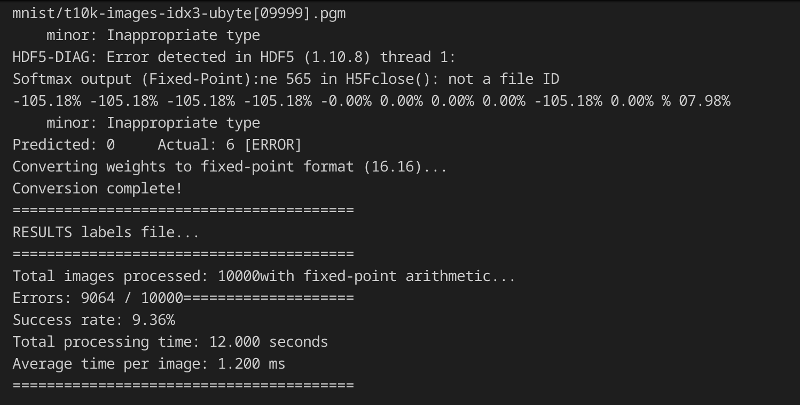

# Embeded-AI

## Quickstart: How to run the project

### Installing the dependencies

Using a Linux operating system, type the following command on the terminal:

``` bash
sudo apt install -y libhdf5-dev
```

## How the code works

### LeNet

LeNet-5 is a pioneering convolutional neural network (CNN) architecture designed by Yann LeCun in 1998. Originally created for handwritten digit recognition, it has become a fundamental model in deep learning. The architecture consists of:

1. Input Layer: 32x32 grayscale images
2. Feature Extraction Layers:
   - Two sets of Convolution + Pooling layers
   - Conv1: 6 feature maps (5x5 kernel)
   - Pool1: Average pooling (2x2)
   - Conv2: 16 feature maps (5x5 kernel)
   - Pool2: Average pooling (2x2)
3. Classification Layers:
   - Three Fully Connected layers
   - Final output: 10 nodes (digits 0-9)

In our implementation, we provide both floating-point and fixed-point versions to demonstrate the trade-off between precision and computational efficiency. The fixed-point implementation is optimized for embedded systems where hardware resources are limited.

## Developping and improving AI's layers

### Fully connected

File: fc.c

#### First run

``` bash
Softmax output: 
0.00% 0.00% 0.00% 0.00% 0.00% 0.00% 100.00% 0.00% 0.00% 0.00% %  

Predicted: 6 	 Actual: 6
TOTAL PROCESSING TIME (gettimeofday): 16.000000 s


Errors : 1437 / 10000

Success rate = 85.629997%
```

#### Optimizing it:

To optimize fc.c I've transpformed the expected parameters into constants, this enables vectorization

No improvement in the precision was noticed, but the processing time was reduced by one second and now is: **15.000000 s**


Float `a une grande precision, mais besoin de passer en Int fixed pour augmenter la performance.


Utilisation de fixed mais `a faible precision
