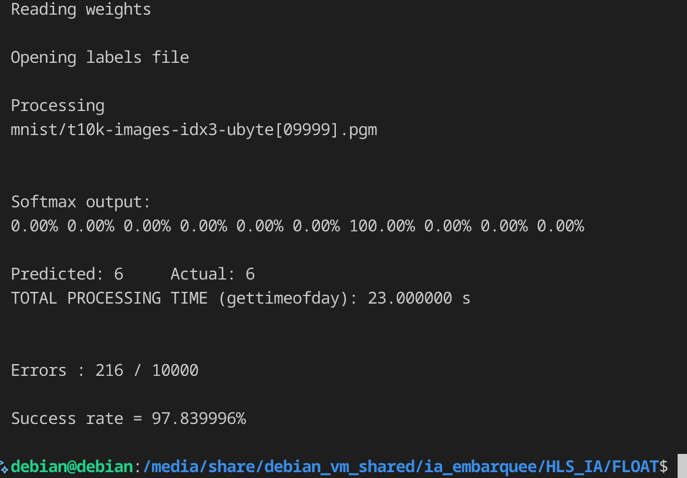

# Embeded-AI

> Embedded-focused implementation of **LeNet-5**, exploring **floating-point vs fixed-point** inference, performance trade-offs, and low-level optimizations for constrained hardware.

---

## Badges


---

## Project Goals

This project focuses on **bringing classic CNN architectures to embedded systems** by:

- Implementing **LeNet-5 from scratch in C**
- Comparing **floating-point vs fixed-point** arithmetic
- Studying the impact of **precision loss vs execution speed**
- Applying **low-level optimizations** (constants, vectorization, memory layout)
- Preparing the codebase for **HLS / FPGA-oriented workflows**

This is not a framework. This is about **control, determinism, and performance**.

---

## Architecture Overview — LeNet-5

LeNet-5 is a pioneering convolutional neural network introduced by Yann LeCun (1998), originally designed for handwritten digit recognition (MNIST).

### Network Structure

1. **Input Layer**
   - 32×32 grayscale images

2. **Feature Extraction**
   - Conv1: 6 feature maps, 5×5 kernel
   - Pool1: 2×2 average pooling
   - Conv2: 16 feature maps, 5×5 kernel
   - Pool2: 2×2 average pooling

3. **Classification**
   - Fully Connected layers (FC1 → FC2 → FC3)
   - Output: 10 classes (digits 0–9)

Two implementations are provided:
- **Floating-point** (high precision, slower)
- **Fixed-point** (reduced precision, faster, embedded-friendly)

---

## Quickstart

### Requirements

- Linux-based system
- GCC / Clang
- HDF5 development library

### Install Dependencies

```bash
sudo apt install -y libhdf5-dev
```

---

## Implementation Details

### Fully Connected Layer

**File:** `fc.c`

The fully connected layer is implemented manually, without external ML libraries, allowing:

- Explicit control over memory access
- Deterministic execution
- Easy migration to fixed-point arithmetic

#### First Run (Baseline)

```text
Softmax output:
0.00% 0.00% 0.00% 0.00% 0.00% 0.00% 100.00% 0.00% 0.00% 0.00%

Predicted: 6   Actual: 6
TOTAL PROCESSING TIME (gettimeofday): 16.000000 s

Errors : 1437 / 10000
Success rate = 85.629997%
```

---

### Optimization Strategy

Optimizations applied to `fc.c`:

- Converted expected parameters to **compile-time constants**
- Enabled **automatic vectorization** by the compiler
- Reduced memory indirections

#### Results

- **Accuracy:** unchanged  
- **Execution time:** reduced from **16s → 15s**

```text
Optimized processing time: 15.000000 s
```

---

## Floating vs Fixed-Point

| Aspect | Floating-Point | Fixed-Point |
|------|---------------|-------------|
| Precision | High | Limited |
| Speed | Slower | Faster |
| Hardware Cost | Expensive | Cheap |
| Embedded Suitability | Poor | Excellent |

> Floating-point offers comfort. Fixed-point offers control.

---

## Visual Results

### Floating-Point (High Precision)



---

## Disclaimer

This project is **educational and experimental**.

---

*Classic networks. Low-level control. Embedded mindset.*
